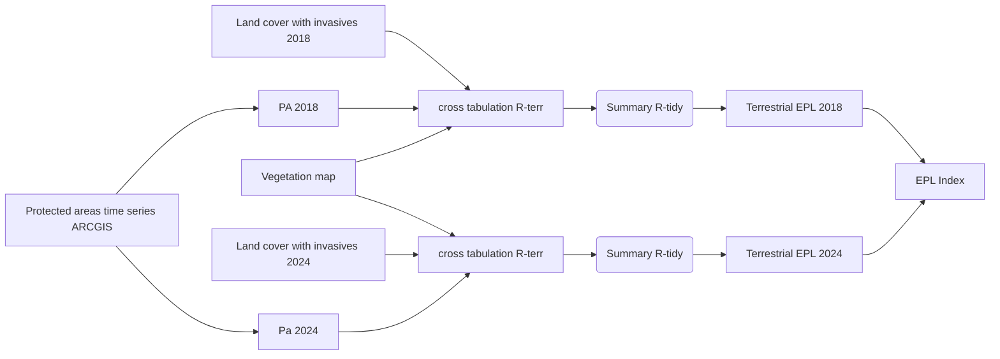
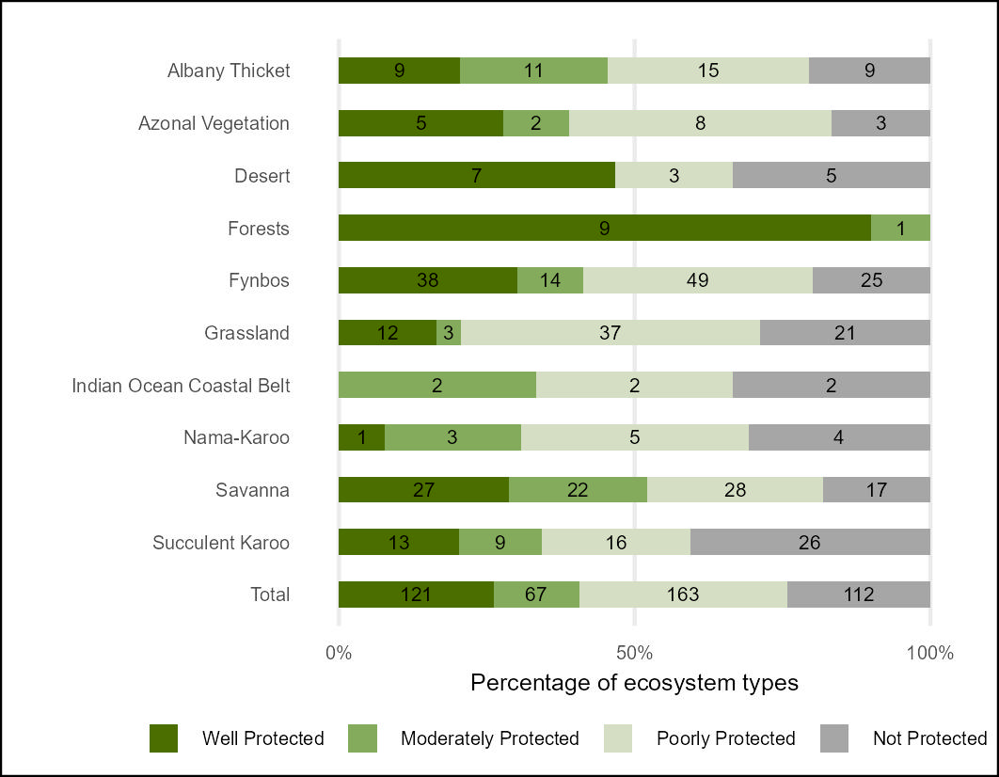
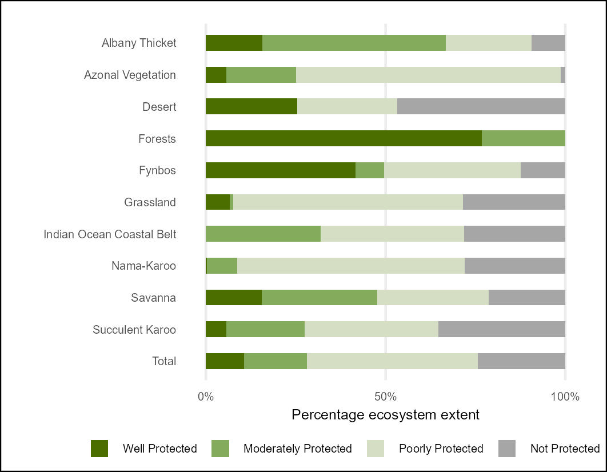

## Workflows for undertaking the terrestrial Ecosystem Protection Level (EPL) assessment

### **National Biodiversity Assessment - South Africa**

*South African National Biodiversity Institute (SANBI)*

June 2025

#### Summary

This Repository contains a workflow that results in the NBA 2025 Ecosystem Protection Level indicators for Terrestrial Ecosystems of South Africa. The terrestrial ecosystem map (vegetation), land cover change data and protected areas time series data were prepared in ARCGIS PRO and imported to R. The land cover data for 2018 and 2014 includes invasive alien plant data, The three layers were aligned and stacked and then cross tabulated (using the terra package) for each time point (2018 and 2014). This analysis is focused on producing indicators for protected areas for South Africa and includes steps to mask out ecosystem extent that extends into Eswatini and Lesotho. The results were summarised in R (using tidyverse package) and Ecosystem Protection Level and Ecosystem Protection Level Index was calculated for each ecosystem type for 2018 and 2014. In addition a separate workflow calculates basic protection metrics at multiple time points from 1990 to 2024.

#### Ecosystem Protection Level Analysis

Terrestrial Ecosystem Protection Level was calculated by assessing the degree to which protected areas targets for each ecosystem were met. By cross tabulating land cover, terrestrial ecosystem maps (vegetation map), protected areas maps for 2018 and 2024 we calculated for each ecosystem type (465 types of terrestrial ecosystems described for South Africa): i) the full extent of the type (**a**), ii) the full extent of the type within the PA network (b), iii) natural remaining the extent of the type within the PA network (including invaded areas) (**c**), iv) the extent of invasion by alien plants within the PA network for each type (**d**).

[The target for each type was expressed in km2:]{.underline}

-   ***e = ecosystem type target % X a*** *[note if no ecosystem specific targets are available then use 30% to align with GBF target]*

The extent of of each type within the PA network was adjusted for habitat loss and invasion:

The natural remaining extent within the PA network (c) was **adjusted downwards** (**f**) by subtracting 70% of the invaded extent (**d**) within the PA network. This step ensures that effectiveness of PA network is accounted for to a degree by preventing areas heavily degraded by invasive alien plants from fully contributing to ecosystem representation targets.

-   ***f = c - ( 0.7 X d )*** [note for this analysis the invasives data are estimated to represent \>= 70% severity of biotic disruption]

[Ecosystem Protection Level Classes:]{.underline}

-   Well Protected (WP); target met or exceeded; ***f \>= e***

-   Moderately Protected (MP); \>= 50 & \< 100% of target met; ***f\>=0.5\*e % \< e***

-   Poorly Protected (PP); \>= 5% & \< 50% of target met; ***f\>=0.05\*e & \<0.5\*e***

-   Not Protected (NP); less than 5% of target met; ***f\<0.05\*e***

**Calculate EPL Index**

EPL Index calculation (Harris et al., in review) (based on Red List Index for Threatened Species)

-   ***EPLI = (count of WP X 3 + count of MP X 2 + count of PP X 1 + count NP X 0 ) / count all types X 3***

Details of the workflow can be found in this quarto document [Terr_EPL_with_inv.qmd](Terr_EPL_with_inv.qmd)

The overall results for EPL 2018 and 2024 can be found here:

[outputs/results_df_EPL_2024_invasives2.csv](outputs/results_df_EPL_2024_invasives2.csv) &

[outputs/results_df_EPL_2018_invasives2.csv](outputs/results_df_EPL_2018_invasives2.csv)

Biome level summary results can be found here:

[outputs/results_df_EPL_2024_biome_invasives2.csv](outputs/results_df_EPL_2024_biome_invasives2.csv) &

[outputs/results_df_EPL_2018_biome_invasives2.csv](outputs/results_df_EPL_2018_biome_invasives2.csv)

Bar plot of EPL 2024 [outputs/epl24_bar_plot.jpeg](outputs/epl24_bar_plot.jpeg)

Line plot of EPL Index 2018-2024 [outputs/epli_line_plot.jpeg](outputs/epli_line_plot.jpeg)

| EPL 2024 - Count of types per category | EPL 2024 - Extent remaining of types per category |
|------------------------------------|------------------------------------|
|  |  |
